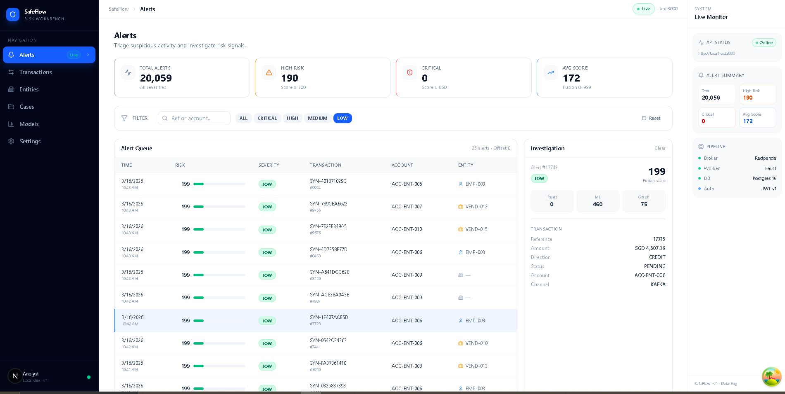
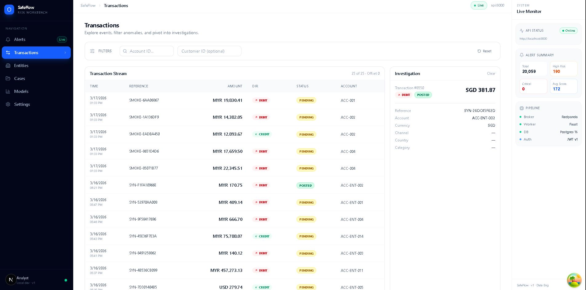
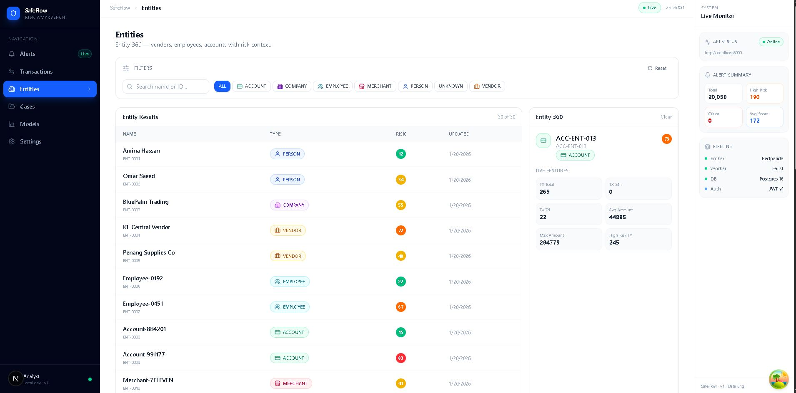
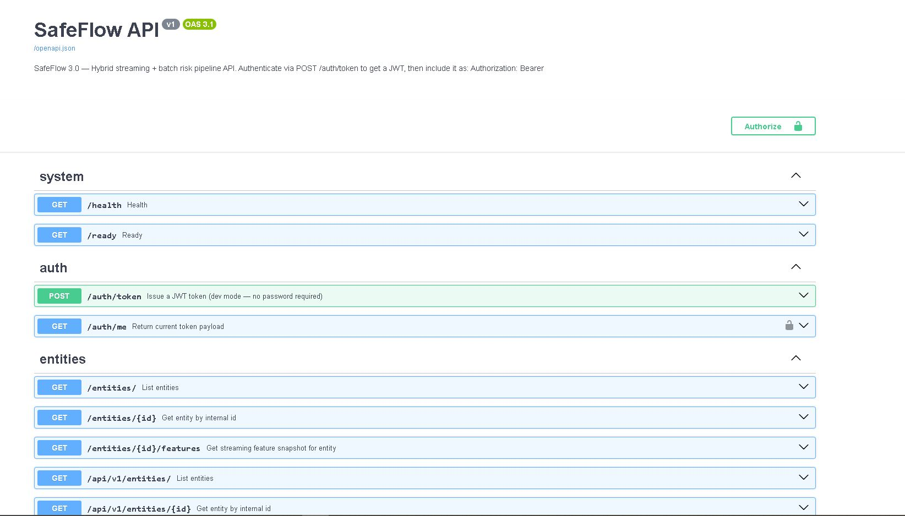

# SafeFlow 3.0

**Hybrid streaming + batch data pipeline for financial transaction risk scoring.**

Built as a portfolio project demonstrating production data engineering practices:
event-driven architecture, feature computation, idempotent persistence, data validation,
and a JWT-secured FastAPI backend — with a live analyst dashboard.

---

## Screenshots

**Alerts** — KPI cards, severity badges, risk score bars, investigation panel with rule breakdown



**Transactions** — colored status badges (POSTED/PENDING/REVERSED), direction indicators, detail panel



**Entities** — type icons (Person, Company, Vendor, Employee, Account, Merchant), risk pills, Entity 360 live features



**API** — FastAPI auto-generated docs with JWT auth, versioned endpoints



---

## Architecture Overview

```
Producer (Python)
    │
    ▼
Redpanda (Kafka-compatible broker)
    │   topic: transactions_raw
    ▼
Faust Streaming Worker
    ├── Validate events (7 rejection codes → rejected_events table)
    ├── Enrich → transactions_enriched topic
    ├── Score (rule engine + dummy ML + graph engine → fusion 0–999)
    ├── Upsert transactions (ON CONFLICT DO UPDATE)
    ├── Upsert entity_features (rolling aggregates)
    └── Insert alerts
    │
    ▼
PostgreSQL 16
    ├── transactions          (fact table, idempotent)
    ├── alerts                (risk scores + severity)
    ├── entity_features       (streaming feature store — latest snapshot)
    ├── entity_daily_summary  (batch aggregates)
    ├── rejected_events       (invalid events with reason + payload)
    └── audit_log             (write action trail)
    │
    ▼
Batch Job (daily)               FastAPI (REST + JWT)
    ├── Recompute 24h/7d           ├── /api/v1/entities/{id}/features
    ├── entity_daily_summary       ├── /api/v1/alerts/summary
    └── Sync entity risk scores    └── /auth/token (analyst | manager)
    │
    ▼
Next.js Analyst Dashboard
    ├── /alerts    — risk queue with KPI cards
    ├── /entities  — Entity 360 with live feature tiles
    ├── /transactions — transaction stream
    ├── /models    — pipeline stats + score distributions
    └── /cases     — investigation roadmap
```

---

## What Is Implemented

| Component | Status | Details |
|-----------|--------|---------|
| Streaming pipeline | ✅ | Redpanda → Faust → Postgres, ~20ms latency |
| Synthetic producer | ✅ | 10k events, 15 entity profiles, 3 risk tiers, 5k msg/s |
| Event validation | ✅ | 7 rejection codes, `rejected_events` table |
| Idempotent upserts | ✅ | `ON CONFLICT DO UPDATE` on `(tenant_id, tx_id)` |
| Entity feature store | ✅ | Rolling tx count, amount avg/max, risk score avg, velocity flag |
| Batch recompute | ✅ | Exact 24h/7d windows, `entity_daily_summary`, entity risk sync |
| Schema constraints | ✅ | FK from alerts→transactions, unique constraints, updated_at triggers |
| Data quality | ✅ | Pydantic validator, rejection table with payload + reason |
| JWT auth | ✅ | HS256, analyst/manager roles, `/api/v1` versioning |
| Structured logging | ✅ | JSON lines with `event`, `latency_ms`, `service` fields |
| Unit tests | ✅ | 76 tests passing (validator, auth, batch logic) |
| CI pipeline | ✅ | GitHub Actions: unit tests + lint + Docker build check |
| Analyst dashboard | ✅ | Alerts, Entities, Transactions, Models, Cases, Settings |

## What Is Not Implemented

| Component | Status |
|-----------|--------|
| Real ML model | ❌ Dummy scorer only — XGBoost not trained |
| RBAC enforcement on endpoints | ❌ Auth exists, route guards not wired |
| Case management CRUD | ❌ Schema planned, not built |
| Prometheus metrics endpoint | ❌ Not implemented |
| Integration tests | ❌ Unit tests only |

---

## Stack

| Layer | Technology |
|-------|-----------|
| Streaming broker | Redpanda (Kafka-compatible) |
| Stream processor | Faust 0.11 |
| Database | PostgreSQL 16 |
| Cache | Redis 7 |
| API framework | FastAPI + Uvicorn |
| ORM | SQLModel + SQLAlchemy |
| Auth | python-jose (HS256 JWT) |
| Validation | Pydantic v2 |
| Dashboard | Next.js 14 + Tailwind + TanStack Query |
| Containerization | Docker + Docker Compose |
| Testing | pytest + pytest-cov |
| CI | GitHub Actions |

---

## Local Setup

### Prerequisites
- Docker Desktop running
- Python 3.11
- Node.js 18+

### 1. Clone and start the stack

```bash
git clone https://github.com/kamal-01-wjua/safeflow.git
cd safeflow
cd infra/docker
docker compose up -d
```

Wait ~20 seconds for all healthchecks to pass:

```bash
docker ps
# All 5 containers should show healthy/running:
# safeflow-postgres, safeflow-redpanda, safeflow-redis,
# safeflow-api, safeflow-risk-worker
```

### 2. Verify API is up

```bash
curl http://localhost:8000/health
# {"status":"ok"}

curl http://localhost:8000/ready
# {"status":"ready","db":"ok"}
```

### 3. Run the synthetic producer

```bash
# Install kafka-python if not present
pip install kafka-python

# Send 10,000 synthetic events
python tools/produce_synthetic_10k.py
```

Expected output:
```
SafeFlow Synthetic Producer
  Target: 10,000 events
  Rate:   ~5,000 msg/s
  Errors: 0
Done.
```

### 4. Watch the worker process events

```bash
docker logs safeflow-risk-worker -f
```

You should see JSON log lines:
```json
{"event": "event_processed", "tx_ref": "SYN-...", "risk_score": 521, "severity": "HIGH", "latency_ms": 18.7}
```

### 5. Verify data in Postgres

```bash
docker exec -it safeflow-postgres psql -U safeflow -d safeflow -c \
  "SELECT COUNT(*) FROM transactions; SELECT COUNT(*) FROM alerts; SELECT COUNT(*) FROM entity_features;"
```

### 6. Run the batch recompute

```bash
# Install psycopg2-binary if not present
pip install psycopg2-binary

# Dry run first
python tools/batch_recompute.py --dry-run

# Full recompute
python tools/batch_recompute.py
```

### 7. Start the analyst dashboard

```bash
cd apps/analyst-dashboard
npm install
npm run dev
# Open http://localhost:3000
```

### 8. Get a JWT token

```bash
# PowerShell
Invoke-RestMethod -Method POST -Uri "http://localhost:8000/auth/token" `
  -ContentType "application/json" `
  -Body '{"username":"analyst","role":"analyst"}'

# Returns: { access_token, token_type, role, expires_in }
```

---

## Running Tests

```bash
# Install test dependencies
pip install pytest pytest-cov python-jose[cryptography]

# Run all unit tests
pytest tests/unit/ -v

# With coverage
pytest tests/unit/ --cov=packages/validation --cov=apps/api/app --cov=tools
```

Expected: **76 passed**

---

## Key Design Decisions

**Why Redpanda instead of Kafka?**
Kafka-compatible, single binary, no ZooKeeper dependency. Simpler for local dev while demonstrating the same streaming patterns.

**Why idempotent upserts instead of insert-only?**
Events can be replayed from the topic offset. `ON CONFLICT DO UPDATE` means replaying 10k events produces exactly the same state — no duplicate rows, no manual dedup logic needed.

**Streaming approximation + batch accuracy**
The streaming worker maintains running counters for 24h/7d windows (fast, approximate). The daily batch job recomputes exact values using SQL window functions over `tx_time`. This hybrid pattern is how production feature stores work.

**Validation before persistence**
Events are validated before any DB write. Invalid events are persisted to `rejected_events` with the original payload and a reason code — making bad data visible and replayable, not silently dropped.

---

## DB Schema (key tables)

```sql
transactions        -- fact: all processed events, idempotent on (tenant_id, tx_id)
alerts              -- risk scores per transaction, FK → transactions.id
entity_features     -- latest feature snapshot per entity (streaming-updated)
entity_daily_summary -- daily aggregates per entity (batch-computed)
rejected_events     -- invalid events with rejection_code + raw_payload
audit_log           -- write action trail for future case management
```

---

## Portfolio Positioning

This project demonstrates:

- **Streaming data engineering** — event-driven pipeline with Kafka-compatible broker, consumer groups, topic partitioning
- **Feature store pattern** — incremental streaming updates + daily batch recompute for accuracy
- **Data quality engineering** — validation layer, rejection table, idempotent writes
- **Backend engineering** — FastAPI, JWT auth, versioned API, centralized error handling
- **Testing discipline** — 76 unit tests, CI pipeline with GitHub Actions
- **Honest scope** — ML scoring uses a dummy model; the infrastructure to serve a real model is built

> "Built a hybrid streaming + batch pipeline for financial risk scoring using Redpanda, Faust, PostgreSQL, and FastAPI — with a feature store, data validation layer, JWT-secured API, and CI-tested unit tests."

---

## Project Structure

```
safeflow/
├── apps/
│   ├── api/                    # FastAPI service
│   │   └── app/
│   │       ├── main.py         # App entry point, router mounts
│   │       ├── auth.py         # JWT creation + verification
│   │       ├── dependencies.py # RBAC dependencies
│   │       └── routers/        # Endpoint handlers
│   ├── analyst-dashboard/      # Next.js dashboard
│   └── streaming/
│       └── risk_stream_worker/ # Faust streaming worker
│           └── app.py
├── packages/
│   ├── db/                     # SQLModel models + session
│   ├── validation/             # Event validator
│   └── shared_types/           # Pydantic response schemas
├── tools/
│   ├── produce_synthetic_10k.py  # 10k event producer
│   ├── produce_bad_events.py     # Validation test producer
│   └── batch_recompute.py        # Daily batch job
├── infra/
│   ├── docker/docker-compose.yml
│   └── sql/                    # Migration files (001–006)
└── tests/
    └── unit/                   # pytest unit tests
```

---

## Author

Kamal — Data Engineering Portfolio Project
GitHub: [kamal-01-wjua](https://github.com/kamal-01-wjua)
